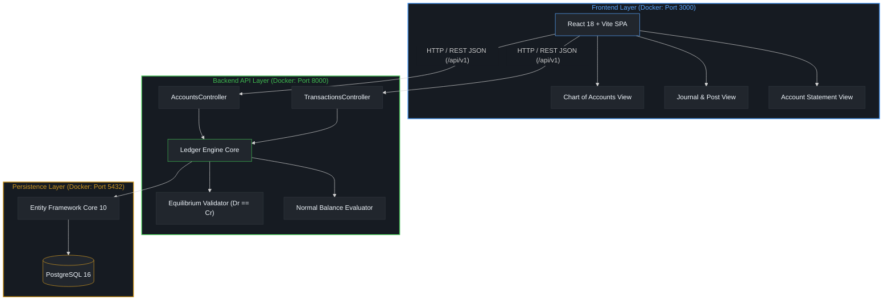
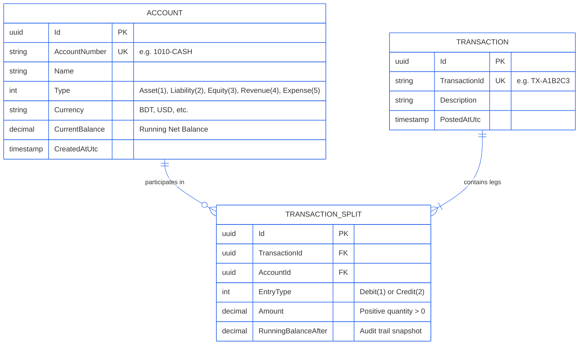
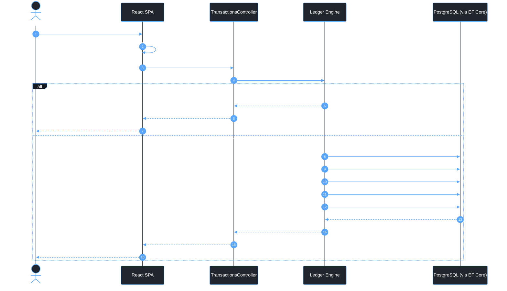

# Mini Transaction Ledger

[](https://github.com/SaifullahMnsur-Again/Mini-Transaction-Ledger)

**Repository URL:** [https://github.com/SaifullahMnsur-Again/Mini-Transaction-Ledger](https://github.com/SaifullahMnsur-Again/Mini-Transaction-Ledger)

---

Mini Transaction Ledger is a robust, full-stack double-entry bookkeeping engine and financial transaction ledger built with **.NET 10**, **PostgreSQL 16**, and **React 18** with **Tailwind CSS**.

The system enforces atomic ledger posting, strict mathematical equilibrium ($\sum \text{Debits} = \sum \text{Credits}$), accounting normal-balance conventions across five standard account classifications, and chronological T-account statement generation with running balance audit trails.

---

## Tech Stack

- **Backend:** .NET 10 (ASP.NET Core Web API, C#)
- **Data & ORM:** PostgreSQL 16, Entity Framework Core 10 (Code-First Migrations)
- **Frontend:** React 18, TypeScript, Vite, Tailwind CSS, Heroicons
- **Containerization & Orchestration:** Docker, Docker Compose (Multi-stage builds)
- **Architecture Standard:** Domain-Driven Design (DDD), Clean Double-Entry Accounting Core, RESTful API (v1)

---

## System Architecture



---

## Data Model & Relationships (ERD)



---

## Inner Workings & Ledger Mechanics

### 1. Atomic Transaction Sequence & Equilibrium Validation

Every financial transaction passes through strict invariant validation before any persistence occurs:



### 2. Normal Balance Conventions

Account balances adjust strictly based on standard financial accounting principles:

| Classification | Normal Balance | Impact of Debit ($+$) | Impact of Credit ($-$) |
| --- | --- | --- | --- |
| **Asset** | Debit | Increases Balance ($+$) | Decreases Balance ($-$) |
| **Expense** | Debit | Increases Balance ($+$) | Decreases Balance ($-$) |
| **Liability** | Credit | Decreases Balance ($-$) | Increases Balance ($+$) |
| **Equity** | Credit | Decreases Balance ($-$) | Increases Balance ($+$) |
| **Revenue** | Credit | Decreases Balance ($-$) | Increases Balance ($+$) |

### 3. Chronological Statement Audit Trails (T-Accounts)

When requesting an Account Statement (`/api/v1/accounts/{accountNumber}/statement`), the engine:

1. Queries all splits associated with the targeted account in ascending order of posting timestamp (`PostedAtUtc`).
2. Reconstructs opening and closing balance baselines.
3. Outputs an immutable chronological ledger displaying transaction references, counter-party legs, debit/credit categorizations, and running balance progression after every transaction.

### 4. Precision & Financial Consistency Guarantees

* **Decimal Precision:** All monetary amounts are handled strictly as fixed-point `decimal` (`decimal(18, 4)` in SQL) to prevent floating-point inaccuracies.
* **Atomicity:** Posting a transaction executes within an explicit database transaction (`BEGIN TRANSACTION ... COMMIT`). If balance computation or split insertion fails for any leg, the entire batch rolls back.
* **Immutability:** Posted journal entries and splits cannot be modified or deleted. Adjustments require compensating reversing entries, preserving an auditable history.

---

## Setup & Run Instructions

### Prerequisites

* [Docker](https://docs.docker.com/get-docker/) & [Docker Compose](https://docs.docker.com/compose/) installed on the host machine.
* Ports `3000` (Frontend), `8000` (Backend API), and `5432` (PostgreSQL) available.

### 1. Launch with Docker Compose (Recommended)

From the project root directory:

```bash
# Clone repository
git clone https://github.com/SaifullahMnsur-Again/Mini-Transaction-Ledger.git
cd Mini-Transaction-Ledger

# Build and start all services in detached mode
docker compose up --build -d
```

Check the health status of all containers:

```bash
docker compose ps
```

Once running:

* **Web UI:** http://localhost:3000
* **Backend API:** http://localhost:8000/api/v1/accounts
* **PostgreSQL Port:** `localhost:5432` (`POSTGRES_DB=ledger_db`, `POSTGRES_USER=postgres`)

### 2. Manual Local Development Setup (Alternative)

#### Backend (.NET 10)

```bash
cd backend
dotnet restore
dotnet run
```

#### Frontend (React + Vite)

```bash
cd frontend
npm install
npm run dev
```

---

## API Reference Summary

| Method | Endpoint | Description |
| --- | --- | --- |
| `GET` | `/api/v1/accounts` | Retrieve all accounts in the Chart of Accounts |
| `POST` | `/api/v1/accounts` | Create a new general ledger account |
| `GET` | `/api/v1/accounts/{accountNumber}/statement` | Retrieve chronological statement and running balances for an account |
| `GET` | `/api/v1/accounts/metadata/entry-types` | Fetch entry types metadata (`Debit = 1`, `Credit = 2`) |
| `POST` | `/api/v1/transactions` | Post an atomic, balanced double-entry transaction |
| `GET` | `/api/v1/transactions` | Retrieve all historical journal transactions |
| `GET` | `/api/v1/transactions/{id}` | Inspect a transaction and its ledger legs by ID |

---

## Verification & Testing Workflow

1. Open **http://localhost:3000**.
2. Under **Chart of Accounts**, create at least two accounts (e.g., an **Asset** account `1010-CASH` and an **Equity** account `3010-CAPITAL`).
3. Navigate to **Journal & Transactions**:
* Set `1010-CASH` as the **Debit Leg** and `3010-CAPITAL` as the **Credit Leg**.
* Input amount `50000.00` with description `Initial Shareholder Capital`.
* Observe the live invariant pill validate equilibrium (`Balanced: Dr == Cr`).
* Click **Commit Transaction** to post the entry.


4. Verify the new transaction displays under the **General Ledger Journal Log** below. Click **Inspect ↗** to open the audit modal.
5. Switch to the **Account Statement** tab, select `1010-CASH`, and review the chronological audit trail, KPI cards, and CSV export.